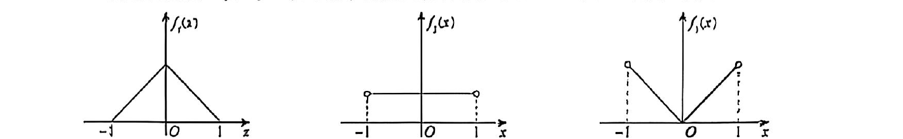

# 第02题

来源：张宇1000题数一（习题分册）·基础篇·概率论与数理统计·第四章 随机变量的数字特征  
原书印刷页：第61页  
PDF物理页：第64页

## 题目

设随机变量 $X_1,X_2,X_3$ 的概率密度图像分别如图（a）～图（c）所示，则（ ）。

（A）$D(X_1)<D(X_2)<D(X_3)$

（B）$D(X_1)<D(X_3)<D(X_2)$

（C）$D(X_2)<D(X_1)<D(X_3)$

（D）$D(X_2)<D(X_3)<D(X_1)$
