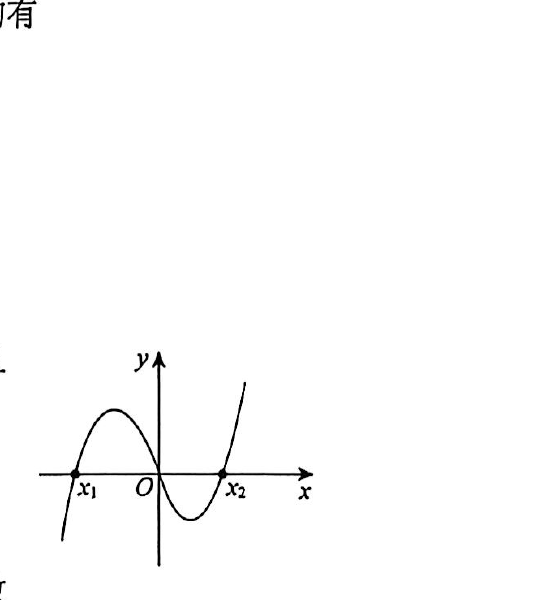

# 第10题

来源：张宇1000题数一（习题分册）·基础篇·高等数学·零基础
原书印刷页：第3页
PDF物理页：第6页

## 题目

函数

$$
f(x)=ax^3+bx^2-2x\quad(a,b\in\mathbb R,\ ab\ne0)
$$

的图像如图所示，且 $x_1+x_2<0$，则有（ ）。

（A）$a>0,b>0$

（B）$a<0,b<0$

（C）$a<0,b>0$

（D）$a>0,b<0$
