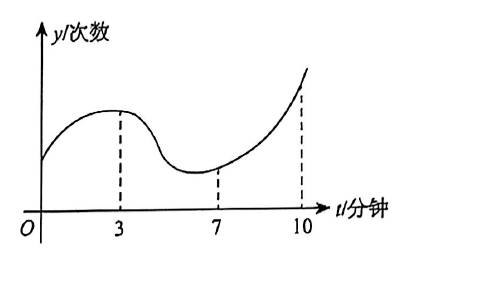

# 第2题

设二阶可导函数 \(y=f(t)\) 表示某人在 10 分钟内心跳次数的变化曲线，如图所示。则关于此人心跳次数的增长速度，说法正确的是（ ）。

A. \(0\sim3\) 分钟增速变小；\(7\sim10\) 分钟增速变大

B. \(0\sim3\) 分钟增速变大；\(7\sim10\) 分钟增速变小

C. \(0\sim3\) 分钟增速变大；\(7\sim10\) 分钟增速变大

D. \(0\sim3\) 分钟增速变小；\(7\sim10\) 分钟增速变小

