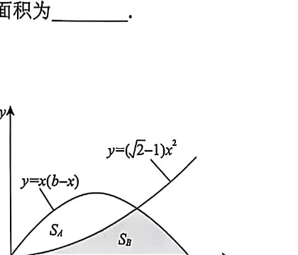

# 第3题

如图所示，抛物线
\[
y=(\sqrt2-1)x^2
\]
把
\[
y=x(b-x)\qquad(b>0)
\]
与 \(x\) 轴所围成的闭区域分为面积为 \(S_A\) 与 \(S_B\) 的两部分，则（ ）。

A. \(S_A<S_B\)

B. \(S_A=S_B\)

C. \(S_A>S_B\)

D. \(S_A\) 与 \(S_B\) 大小关系与 \(b\) 的数值有关

