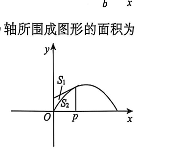

# 第4题

过点 \((p,\sin p)\) 作曲线 \(y=\sin x\) 的切线（见图），设该曲线与切线及 \(y\) 轴所围成图形的面积为 \(S_1\)，曲线与直线 \(x=p\) 及 \(x\) 轴所围成图形的面积为 \(S_2\)，则（ ）。

A. \(\displaystyle\lim_{p\to0^+}\frac{S_2}{S_1+S_2}=\frac13\)

B. \(\displaystyle\lim_{p\to0^+}\frac{S_2}{S_1+S_2}=\frac12\)

C. \(\displaystyle\lim_{p\to0^+}\frac{S_2}{S_1+S_2}=\frac23\)

D. \(\displaystyle\lim_{p\to0^+}\frac{S_2}{S_1+S_2}=1\)

