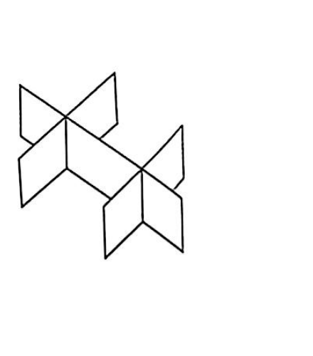

# 第06题

来源：张宇1000题数一（习题分册）·强化篇·线性代数·第5章 线性方程组  
原书印刷页：第126页  
PDF物理页：第127页

## 题目

如图所示有三张平面，其中有两张平面平行，第三张平面与它们相交，其方程

$$
a_{i1}x+a_{i2}y+a_{i3}z=d_i\quad(i=1,2,3)
$$

组成的方程组的系数矩阵与增广矩阵分别为 $A$ 和 $\overline{A}$，则（　　）。

（A）$r(A)=2,\ r(\overline{A})=3$  
（B）$r(A)=2,\ r(\overline{A})=2$  
（C）$r(A)=1,\ r(\overline{A})=2$  
（D）$r(A)=1,\ r(\overline{A})=1$

