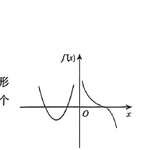

# 第21题

来源：张宇1000题数一（习题分册）·强化篇·高等数学·一元函数微分学的应用（一）--几何应用  
原书印刷页：第83页  
PDF物理页：第84页

## 题目

设函数 $f(x)$ 在 $(-\infty,+\infty)$ 内连续，其一阶导函数 $f'(x)$ 的图形如图所示，并设在 $f'(x)$ 存在处 $f''(x)$ 也存在，则曲线 $y=f(x)$ 的拐点个数为（  ）。

（A）1

（B）2

（C）3

（D）4

