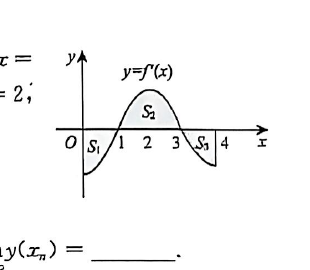

# 第24题

来源：张宇1000题数一（习题分册）·强化篇·高等数学·一元函数微分学的应用（一）--几何应用  
原书印刷页：第83页  
PDF物理页：第84页

## 题目

设 $f(x)$ 在区间 $[0,4]$ 上连续，曲线 $y=f'(x)$ 与直线 $x=0,x=4,y=0$ 围成如图所示的三个区域，其面积分别为 $S_1=3,S_2=4,S_3=2$，且 $f(0)=1$，则 $f(x)$ 在 $[0,4]$ 上的最大值与最小值分别为（  ）。

（A）$2,-3$

（B）$4,-3$

（C）$2,-2$

（D）$4,-2$

