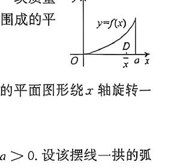

# 第24题

来源：张宇1000题数一（习题分册）·强化篇·高等数学·一元函数积分学的应用（一）--几何应用  
原书印刷页：第94页  
PDF物理页：第95页

## 题目

设函数 $y=f(x)$ 在区间 $[0,a]$ 上非负，$f'(x)>0$，且 $f(0)=0$。有一块质量均匀分布的平板 $D$，其占据的区域是曲线 $y=f(x)$ 与直线 $x=a$ 以及 $x$ 轴围成的平面图形。用 $\bar{x}$ 表示平板 $D$ 的质心的横坐标（见图），证明：

$$
\bar{x}>\frac23a。
$$

