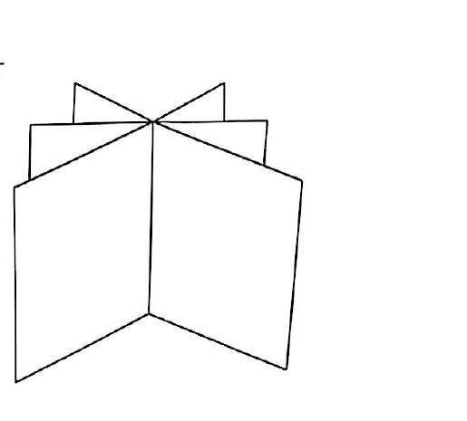

# 第05题

来源：张宇1000题数一（习题分册）·综合篇·测试卷一  
原书印刷页：第155页  
PDF物理页：第155页  

## 题目

在空间直角坐标系 $O-xyz$ 中，三张平面
$$
\pi_1: ax+y-z=1,\qquad
\pi_2: x+y+bz=a,\qquad
\pi_3: x+ay-z=1
$$
的位置关系如图所示，则（　　）。

（A）$a=1,\ b\ne -1$

（B）$a=1,\ b=-1$

（C）$a\ne -2,\ b=2$

（D）$a=-2,\ b=2$
